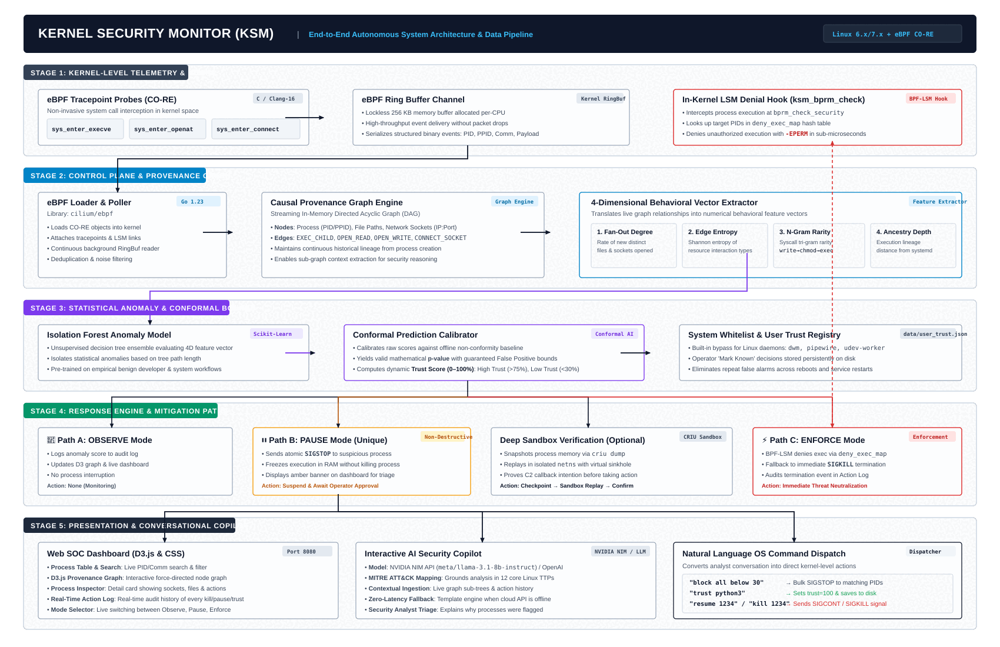

# 🛡️ Kernel Security Monitor (KSM)

> **Autonomous Linux Kernel Security Monitor via eBPF CO-RE, Causal Provenance Graphing, Conformal Anomaly Calibration & AI Security Copilot.**



---

## 🌟 Key Features

* **Zero-Overhead In-Kernel Telemetry**: Uses eBPF CO-RE (*Compile Once - Run Everywhere*) to hook `sys_enter_execve`, `sys_enter_openat`, and `sys_enter_connect`.
* **Sub-Microsecond In-Kernel Enforcement**: BPF-LSM (`ksm_bprm_check`) denies malicious executions directly at `bprm_check_security` with `-EPERM`.
* **Streaming Causal Provenance Graph**: In-memory Directed Acyclic Graph (DAG) tracking Process $\leftrightarrow$ File $\leftrightarrow$ Socket lineage in real-time.
* **4D Behavioral Feature Extraction**: Real-time evaluation of fan-out degree, edge-type entropy, syscall n-gram rarity (`write -> chmod +x -> execve`), and ancestry depth.
* **Statistically Bounded Anomaly Scoring**: Isolation Forest ML sidecar calibrated by **Conformal Prediction** to mathematically guarantee False Positive Rate (FPR) bounds $\to$ **Trust Score (0–100%)**.
* **Novel `PAUSE` Mode (`SIGSTOP`)**: Instantly freezes suspicious processes in RAM without killing them, preventing harm while awaiting operator triage.
* **CRIU Sandbox Replay**: Checkpoints suspicious processes and replays them inside an isolated network namespace sinkhole to confirm C2 beaconing.
* **Interactive AI Security Copilot**: Connected to **NVIDIA NIM**, **OpenAI**, or **Ollama** with MITRE ATT&CK reasoning and direct OS remediation command execution (`kill`, `pause`, `resume`, `trust`).
* **Persistent Whitelist**: Built-in protection for system daemons plus persistent storage (`data/user_trust.json`) for operator-trusted applications across reboots.

---

## 🏗️ Tech Stack

| Layer | Technologies |
|---|---|
| **Kernel Space** | C, eBPF CO-RE, BPF-LSM, Linux BTF (`vmlinux.h`), Clang/LLVM |
| **Control Plane** | Go 1.23, `cilium/ebpf`, In-Memory Graph, REST API, SSE Server |
| **Machine Learning** | Python 3.11+, Scikit-Learn (Isolation Forest), Conformal Prediction |
| **Verification Sandbox** | CRIU (Checkpoint/Restore in Userspace), Network Namespaces (`netns`) |
| **AI Intelligence** | NVIDIA NIM API (`meta/llama-3.1-8b-instruct`), OpenAI, Ollama (`phi3:mini`) |
| **SOC Dashboard** | HTML5, Vanilla CSS, D3.js (v7 Force-Directed Graph), SSE Stream |

---

## 📋 Prerequisites & Dependency Installation

### 1. System Requirements
* **OS**: Linux with Kernel **6.x or newer** (tested on Arch Linux 6.x/7.x and Ubuntu 24.04).
* **BPF-LSM Support**: Ensure `bpf` is in your LSM boot parameters (`cat /sys/kernel/security/lsm`).

### 2. Package Installation

#### On Arch Linux:
```bash
sudo pacman -Syu
sudo pacman -S base-devel clang llvm bpftool bpf libbpf go python python-pip criu
```

#### On Ubuntu / Debian:
```bash
sudo apt update
sudo apt install -y build-essential clang llvm libbpf-dev linux-tools-generic \
                    golang python3 python3-pip python3-venv criu bpftool
```

#### On Fedora / RHEL:
```bash
sudo dnf install -y clang llvm libbpf-devel kernel-devel bpftool golang python3 python3-pip criu
```

---

## 🚀 Step-by-Step Installation & Deployment

### Step 1: Clone Repository
```bash
git clone https://github.com/kumaresanh/kernel-security-monitor.git
cd kernel-security-monitor
```

---

### Step 2: Set Up Python AI Scorer Environment
```bash
# Create and activate Python virtual environment
python3 -m venv venv
source venv/bin/activate

# Install required ML packages
pip install -r sidecar/requirements.txt
```

---

### Step 3: Compile eBPF & Go Sensor
```bash
# Generate vmlinux.h from running kernel & compile eBPF programs (bpf/sensor.o, bpf/lsm.o)
make generate

# Build the main binary
make build
```

---

## 🏃 Running Kernel Security Monitor

### Terminal 1: Start the Python ML Scorer Sidecar
```bash
cd kernel-security-monitor
source venv/bin/activate
python3 sidecar/scorer.py
```
*(Runs on `http://127.0.0.1:8099` with Isolation Forest & Conformal Calibrator).*

---

### Terminal 2: Start Kernel Security Monitor (Root required for eBPF)

Choose **ONE** of the following LLM configurations:

#### Option A: Using NVIDIA NIM API (Recommended)
```bash
cd kernel-security-monitor
export LLM_API_KEY="nvapi-your-nvidia-nim-key"
sudo -E ./kernel-security-monitor --mode observe \
  --llm-endpoint "https://integrate.api.nvidia.com/v1" \
  --llm-model "meta/llama-3.1-8b-instruct"
```

#### Option B: Using Groq / OpenAI API
```bash
cd kernel-security-monitor
export LLM_API_KEY="gsk_your_groq_key_or_openai_key"
sudo -E ./kernel-security-monitor --mode observe \
  --llm-endpoint "https://api.groq.com/openai/v1" \
  --llm-model "llama-3.1-8b-instant"
```

#### Option C: Using Local Ollama (Completely Offline)
```bash
# In another terminal:
ollama pull phi3:mini
ollama serve

# Run Kernel Security Monitor:
cd kernel-security-monitor
sudo -E ./kernel-security-monitor --mode observe \
  --llm-endpoint "http://localhost:11434" \
  --llm-model "phi3:mini"
```

#### Option D: Offline Mode (Built-In Zero-Latency Template Engine)
```bash
cd kernel-security-monitor
sudo ./kernel-security-monitor --mode observe --enable-narration=false
```

---

### Step 4: Open SOC Dashboard
Open your web browser at:
👉 **`http://localhost:8080`**

---

## 🧪 Simulating an Attack (Verification Demo)

In a 3rd terminal, run the multi-stage install-script attack simulation:
```bash
sudo bash scripts/demo_attack.sh
```

**What Happens:**
1. Simulated download of an unknown binary payload into `/tmp`.
2. Execution permission modification (`chmod +x`).
3. Execution trigger $\to$ eBPF captures the rare `write -> chmod +x -> execve` sequence.
4. Anomaly score drops trust to $< 25\%$.
5. In **Pause Mode**, KSM instantly freezes the payload with `SIGSTOP`.
6. In **Enforce Mode**, BPF-LSM denies execution with `-EPERM` or terminates via `SIGKILL`.
7. Dashboard alerts in real-time, and the AI Copilot provides an ATT&CK breakdown.

---

## 💬 Conversational AI Copilot Commands

The dashboard AI Copilot accepts natural language instructions that directly execute OS security commands:

| Natural Language Command | Executed Action |
|---|---|
| `block all below 30` | Bulk suspends (`SIGSTOP`) all processes with Trust Score $< 30$ |
| `trust python3` | Whitelists `python3` to 100% trust and persists in `data/user_trust.json` |
| `pause 1234` | Sends `SIGSTOP` signal to PID 1234 |
| `resume 1234` | Sends `SIGCONT` signal to unfreeze PID 1234 |
| `kill 1234` | Sends atomic `SIGKILL` to PID 1234 |
| `show paused` | Returns live list of currently suspended PIDs from memory |
| `show action log` | Displays audit history of all manual and automated mitigations |

---

## 📂 Project Structure

```
├── bpf/
│   ├── sensor.c              # eBPF tracepoints (execve, openat, connect)
│   ├── lsm.c                 # BPF-LSM bprm_check_security enforcement hook
│   └── vmlinux.h             # Generated kernel BTF definitions
├── cmd/sensor/
│   └── main.go               # Main daemon: eBPF loader, HTTP server, SSE, Copilot dispatch
├── dashboard/
│   ├── index.html            # Web SOC Dashboard (Inspector, Graph, Action Log)
│   ├── app.js                # Real-time SSE handler, D3.js force graph, Chat logic
│   └── style.css             # Responsive dark security theme
├── data/
│   ├── isolation_forest_model.joblib # Pre-trained ML baseline model
│   ├── calibration_scores.json       # Conformal prediction calibration scores
│   ├── ngram_baseline.json           # Normal syscall 3-gram frequencies
│   └── user_trust.json               # Persistent user whitelist registry
├── internal/
│   ├── checkpoint/           # CRIU checkpoint & isolated netns sandbox
│   ├── graph/                # Causal Provenance Graph & 4D feature extraction
│   ├── narration/            # LLM Copilot connector & MITRE ATT&CK table
│   ├── response/             # Response Engine (Observe, Pause, Enforce, ActionLog)
│   └── sensor/               # Go bindings for eBPF loader (cilium/ebpf)
├── sidecar/
│   ├── scorer.py             # FastAPI anomaly scoring microservice (:8099)
│   ├── conformal.py          # Conformal calibration mathematical algorithms
│   └── train_baseline.py     # Offline baseline generator
├── scripts/
│   ├── demo_attack.sh        # Multi-stage attack simulation script
│   ├── deploy_guest_vm.sh    # Automated VM setup script
│   └── test_criu_loop.sh     # CRIU stability verification test
├── architecture_diagram.png  # High-resolution architecture blueprint
├── Makefile                  # Build & orchestration targets
└── README.md                 # Project documentation
```

---

## 📜 License
Apache-2.0 License.
